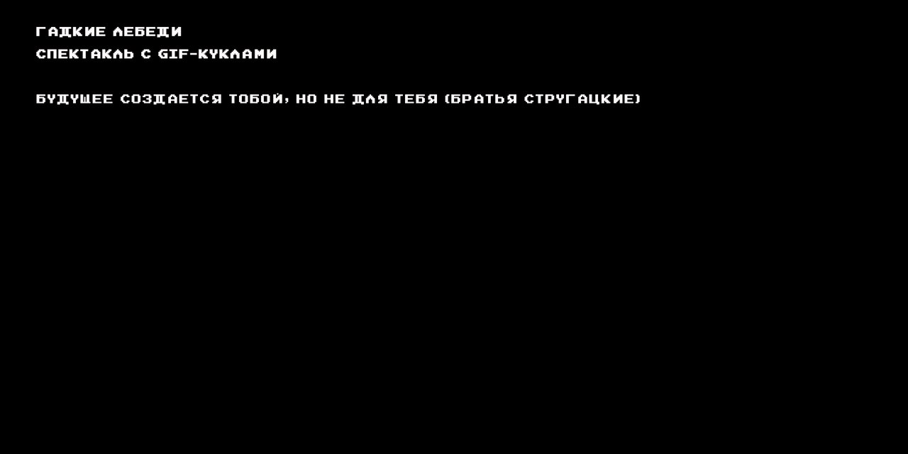

# Гадкие лебеди

*The Ugly Swans*

Сайт-афиша спектакля с GIF-куклами по повести Аркадия и Бориса Стругацких — совместной постановки Музея истории ГУЛАГа и творческого объединения «Таратумб».

**[Открыть архив →](https://gadkie-lebedi.gmig.gulagmemory.org)** · [Все сохранённые сайты](https://gulagmemory.org)

| | |
|:--|:--|
| **Тип** | Сайт спектакля |
| **Годы** | 2019 |
| **Исходный адрес** | `gadkie-lebedi.gmig.ru` |
| **Адрес архива** | [gadkie-lebedi.gmig.gulagmemory.org](https://gadkie-lebedi.gmig.gulagmemory.org) |
| **Снимок сделан** | февраль 2026 · копия исходных файлов |

## О проекте

«Будущее создаётся тобой, но не для тебя». Писатель Виктор Банев возвращается в родной город, где не прекращается дождь, а дети всё больше времени проводят с загадочными «мокрецами» из лепрозория. Он пытается понять, чему их учат и какое будущее несут эти «новые» дети.

Постановка перенесла действие повести в наши дни и соединила кукольный театр с цифровыми технологиями; на сцене играют и взрослые актёры, и дети. Режиссёры — Ольга Шайдуллина и Антон Калипанов, художник-постановщик — Сергей Февралев, медиахудожники — Евгений Афонин и Ян Калнберзин, продюсер — Роман Романов. Сайт — одностраничная афиша с описанием спектакля и составом.

## Что сохранено

- описание спектакля;
- актёрский состав и создатели.

## Что не работает

- продажа билетов не работает.

---

Репозиторий входит в [реестр сохранённых сайтов Музея истории ГУЛАГа](https://gulagmemory.org) — некоммерческий архив цифрового наследия, созданный в исследовательских и образовательных целях. Права на тексты, фотографии, видео и другие материалы принадлежат их авторам и правообладателям.

<b>English</b>

### The Ugly Swans

One-page website for a GIF-puppet stage adaptation of the Strugatsky brothers' novella, produced by the GULAG History Museum and the Taratumb creative collective (premiere 2019): synopsis, cast and creative team.

**Type:** Theatre production website · **Original address:** `gadkie-lebedi.gmig.ru` · **Archive:** [gadkie-lebedi.gmig.gulagmemory.org](https://gadkie-lebedi.gmig.gulagmemory.org)

Part of the [registry of preserved GULAG History Museum websites](https://gulagmemory.org) — a non-commercial digital heritage archive for research and education. All texts, photographs, video and other materials remain the property of their authors and rights holders.

